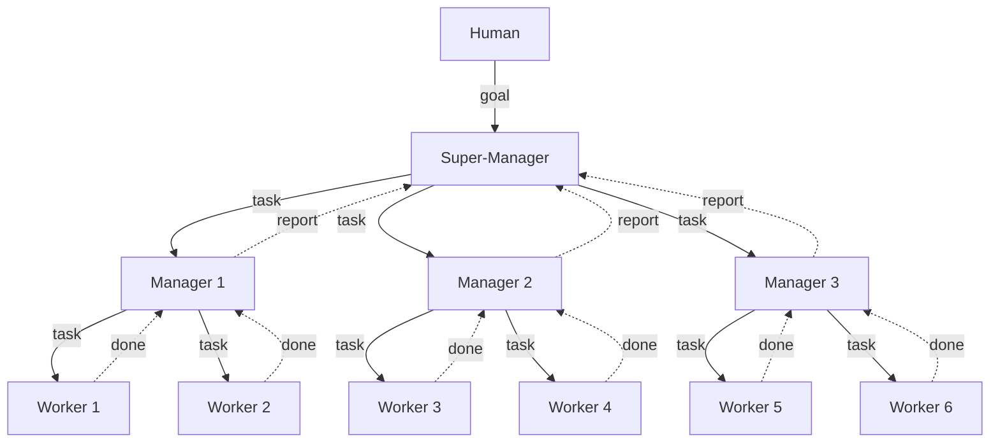

# orchestra

A multi-agent orchestration framework that coordinates AI coding assistants using tmux panes, git worktrees, and a file-based inbox system.

orchestra spawns a hierarchy of agents — a super-manager, managers, and workers — each running in its own tmux pane and isolated git worktree. Agents communicate through a shared file-based inbox, enabling parallel task execution without conflicts.

## Organization hierarchy



- **Super-Manager** — Receives a goal from the human, breaks it into sub-problems, and delegates to up to 3 managers.
- **Manager** — Receives a problem from the super-manager, plans tasks, spawns up to 3 workers, and merges their branches.
- **Worker** — Executes a single task in an isolated git worktree, commits, and reports done.

Communication flows only between adjacent levels via a file-based inbox system (`.agent/{agent-id}/inbox/`).

## Tmux layout

Each manager gets a column, with workers stacked vertically below:

```
| SM   | Mgr1 | Mgr2 | Mgr3 |
|      | Wkr1 | Wkr3 | Wkr5 |
|      | Wkr2 | Wkr4 | Wkr6 |
```

## Commands

### `bin/supermanager`

Launches the super-manager agent in a new tmux window (or session).

```bash
bin/supermanager
```

This is the main entry point. It starts a Claude session with the super-manager and organization prompts, which then orchestrates the rest of the hierarchy.

### `bin/spawn`

Creates an isolated git worktree and launches an AI assistant (Claude or Codex) inside it.

```bash
bin/spawn <agent-name> [options]
```

**Options:**

| Flag | Description |
|------|-------------|
| `--claude` | Use Claude as the assistant |
| `--codex` | Use Codex as the assistant |
| `-p <prompt>` | Inline prompt string |
| `-f <file>` | Read prompt from a file |

**Examples:**

```bash
bin/spawn mgr-frontend --claude -f prompt/manager.md
bin/spawn wkr-api --codex -p "Implement the /users endpoint"
```

Each spawned agent gets:
- Its own git branch (`YYYYMMDD-{hex}`)
- An isolated worktree (`.agent/worktrees/<agent-name>-<suffix>/`)
- A symlinked `.agent/` directory for inbox access
- A tagged tmux pane (`@agent-id`) for reliable identification
